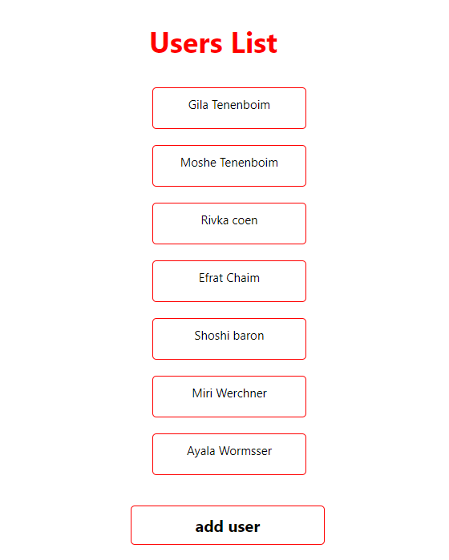
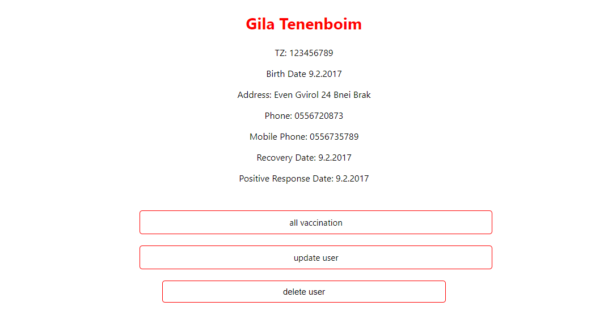
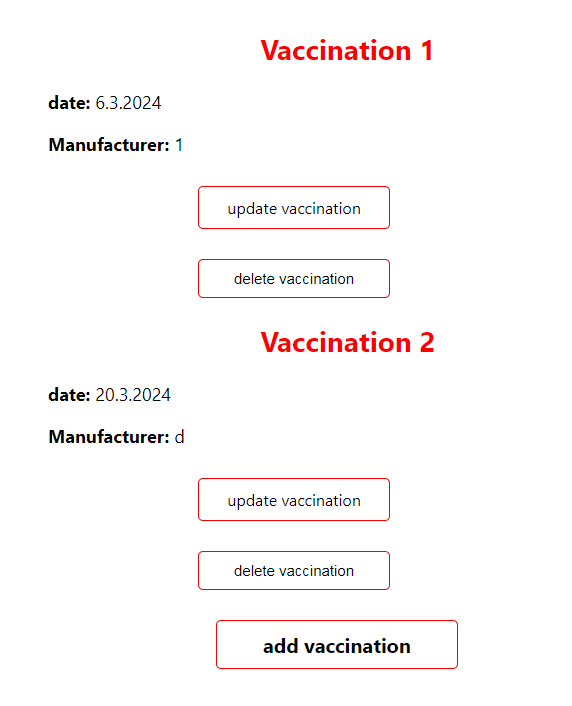
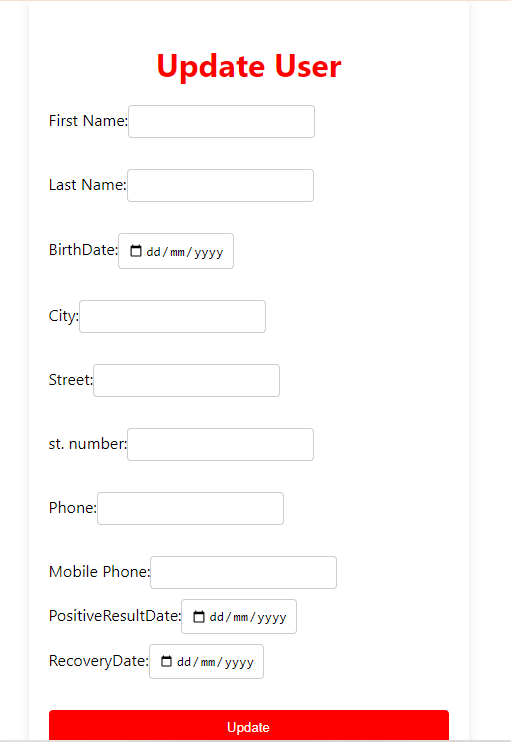
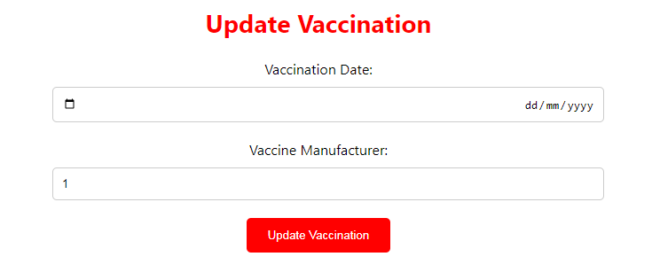
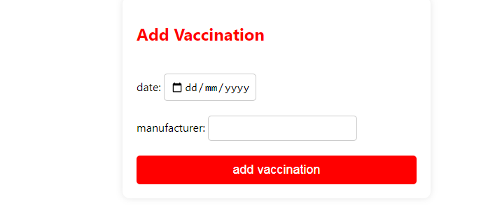

"# CoronaTest" 

I have developed the project using the following technologies:
C# .NET Core: Server-side development
SQL: Database management
DB First approach: Access to the database
Data connection and ConnectionString setup: Achieved by adding DAPPER
Data retrieval from the database: Utilizing DAPPER
React: Client-side development
Axios: Data fetching
npm install: Required to run the project on the client-side

Screenshots:
1.Home Screen - Displaying all Users 

2. Displaying Vaccinated User Details
 
3. Displaying Vaccinated User Details

4.Displaying Details of Non-vaccinated User 

5. Updating User Details

6. Editing Vaccination Details

7.Adding a Vaccination

