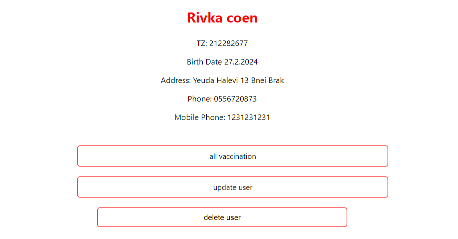

"# CoronaTest" 

כתבתי את הפרויקט ב: 
C# .NET Core - צד שרת  
SQL - מסד הנתונים 
DB First - גישה למסד הנתונים 
Data Connection, ConnectionString ע"י הוספת 
DAPPER השליפה ממסד הנתונים היא באמצעות 
react - צד לקוח 
axios שליפת הנתונים ע"י 
npm install :בשביל להריץ את הפרויקט יש להריץ בצד הלקוח

צילומי מסך: 

1. מסך הבית - הצגת כל המשתמשים 

2. הצגת פרטי משתמש מחוסן
 
3. הצגת החיסונים למשתמש

4. הצגת פרטי משתמש לא מחוסן 

5. עידכון פרטי משתמש

6. עריכת פרטי חיסון 

7. הוספת חיסון 

